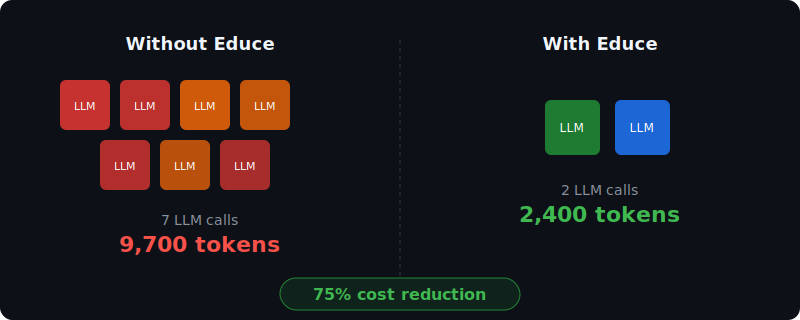
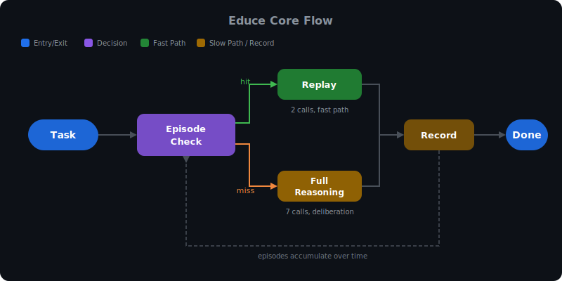
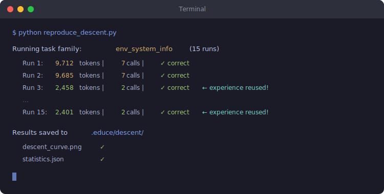

<p align="center">
  <h1 align="center">Educe</h1>
  <p align="center"><strong>Your agent pays 9,700 tokens the first time. 2,400 the second. Zero the tenth.</strong></p>
  <p align="center">
    <a href="LICENSE"></a>
    <a href="https://github.com/oneirozzzz7/educe"></a>
    
  </p>
  <p align="center">
    <a href="#quick-start">Quick Start</a> •
    <a href="#how-it-works">How It Works</a> •
    <a href="#prove-it-yourself">Prove It Yourself</a> •
    <a href="README.zh-CN.md">中文</a>
  </p>
</p>

<p align="center">
  
</p>

---

Educe is an open-source evolution engine for LLM agents. It watches what your agent does, remembers what worked, and replays successful action sequences on similar tasks — so the model doesn't re-derive solutions it already found.

**The core thesis:** an agent's cost to perform a task should monotonically decrease with experience.

Every LLM agent today is a goldfish. The 10,000th run costs the same as the 1st. Educe breaks this.

---

## Quick Start

```bash
git clone https://github.com/oneirozzzz7/educe.git && cd educe
pip install -e ".[web]"
```

```python
from educe import Orchestrator, EduceConfig

config = EduceConfig.from_env()  # reads EDUCE_API_KEY, EDUCE_BASE_URL, EDUCE_MODEL
agent = Orchestrator(config)

# Run 1: full reasoning — 7 LLM calls, ~9,700 tokens
result = await agent.run("Find Python version and summarize system info")

# Run 2: experience replay — 2 LLM calls, ~2,400 tokens (75% cheaper)
result = await agent.run("Find Node version and summarize system info")
```

Launch the full UI:

```bash
export EDUCE_API_KEY=your-key
export EDUCE_BASE_URL=https://api.deepseek.com/v1
export EDUCE_MODEL=deepseek-chat
./start.sh   # → http://localhost:3001
```

Works with any OpenAI-compatible API: DeepSeek, Qwen, GPT-4o, Claude (via proxy), Ollama, etc.

---

## How It Works

<p align="center">
  
</p>

### Design Principles

1. **Zero framework judgment** — The framework holds facts, not opinions. The model decides everything — including when to stop and what's dangerous.
2. **Mechanism, not cognition** — Only hardcoded logic: pause before irreversible actions. Everything else is data the model reads.
3. **Model-portable** — Switch from DeepSeek to GPT-4o to a local Qwen with one env var. Experience transfers across models.

---

## Prove It Yourself

The cost reduction claim is falsifiable. Run this to verify on your own API:

> 📺 Watch the demo locally: `asciinema play docs/assets/demo.cast` (18 seconds) — or run it yourself:

```bash
pip install matplotlib scipy
EDUCE_BASE_URL=https://api.deepseek.com/v1 \
EDUCE_API_KEY=your-key \
EDUCE_MODEL=deepseek-chat \
python reproduce_descent.py
```

<p align="center">
  
</p>

| Metric | Value |
|--------|-------|
| Cost when experience is reused | 2,458 tokens (2 LLM calls) |
| Cost without experience | 9,725 tokens (7 LLM calls) |
| Reduction | **75%** |
| Correctness | 100% in both modes |

Reproduction costs ~$1-2 on DeepSeek (~500K tokens, 30-45 min).

> **Current research frontier:** The reuse mechanism delivers 75% savings reliably, but the model doesn't always choose to reuse (current adoption: 26%). This is our [#1 open problem](docs/descent_analysis.md) — we're working on making retrieval structural rather than optional.

---

## How Is This Different?

| Approach | What it does | What Educe adds |
|----------|-------------|-----------------|
| **Prompt caching** | Caches prompt prefix → saves input tokens | Caches *action sequences* → saves input + output + reduces LLM calls from 7→2 |
| **RAG** | Retrieves documents to augment context | Retrieves *verified execution traces* — proven solutions, not reference material |
| **Fine-tuning** | Updates model weights (needs infra, not portable) | Works with any model via API. Experience transfers instantly |
| **CLAUDE.md / system prompts** | Static rules written by humans | Accumulates rules *from observation* — patterns humans can't articulate |
| **KV cache** | Low-level inference optimization | Orthogonal — Educe operates at agent-behavior level, composable with KV cache |

**The key difference:** Educe doesn't make the model smarter. It makes the *system* remember what worked.

---

## Roadmap

- [x] Action Loop V3 (Plan / Challenge / self-termination)
- [x] ConversationTruth (single data source, tiered compression)
- [x] Shell execution + file ops + streaming
- [x] Descent Curve — mechanism verified (75% gain)
- [x] Benchmark runner (30 cases, automated judge)
- [x] Frontend with i18n (English / Chinese)
- [ ] **Episode adoption reliability** — from 26% → 80%+ (structural enforcement)
- [ ] Context budget precision (WARM tier projection)
- [ ] Desktop app (Electron)
- [ ] Plugin system for custom tools

---

## Documentation

| Doc | What's inside |
|-----|---------------|
| [Vision](docs/VISION.md) | The five axioms and evolution metaphor |
| [Architecture](docs/SESSION11_ARCHITECTURE.md) | Technical deep dive into action_loop_v3 |
| [Descent Analysis](docs/descent_analysis.md) | Episode adoption trace analysis + open problems |
| [Boundary Redesign](docs/BOUNDARY_REDESIGN.md) | Framework as asset container (zero judgment) |

---

## Contributing

See [CONTRIBUTING.md](CONTRIBUTING.md). Issues and PRs welcome.

## License

[Apache-2.0](LICENSE)
